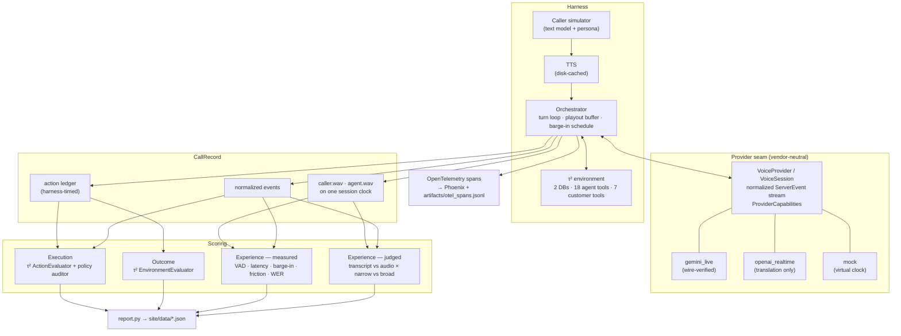

# Architecture — voice-agent-eval-saas-support

## Overview

A three-axis evaluation harness for voice agents — **Execution**, **Outcome**,
**Experience** — built on a τ²-bench B2B SaaS support domain that already has a
published text-channel baseline. The same 16 tasks, the same 7-rule policy, the
same 18 agent tools and the same τ² evaluators are driven over a live realtime
voice API instead of a text channel, so "does the agent degrade when the channel
becomes voice?" is answerable by comparison rather than by assertion.

The design has one organising idea: **measure what can be measured, and judge
only what cannot.** The article this implements leans on LLM judges for the
Experience axis. Here the only realtime voice stack available is Gemini and the
only audio-capable judge available is Gemini, so a judged Experience score would
be a Gemini agent graded by a Gemini judge — same-family self-evaluation. The
response is to push as much of Experience as possible into deterministic
measurement off the recordings and the event timeline, and to confine the judges
to the irreducibly subjective residue, clearly labelled.

## System diagram

## Components

| Component | Responsibility | Tech |
|---|---|---|
| `voiceval/providers/base.py` | The seam: `VoiceProvider`, `VoiceSession`, normalized `ServerEvent`, `ProviderCapabilities`, clocks | Python ABCs |
| `voiceval/providers/gemini_live.py` | Gemini Live `bidiGenerateContent` adapter — verified against the live wire | `websockets` |
| `voiceval/providers/openai_realtime.py` | OpenAI Realtime adapter; pure `translate()` unit-tested, wire unverified | `websockets` |
| `voiceval/providers/mock.py` | Deterministic realtime simulator on a virtual clock | — |
| `voiceval/orchestrator.py` | The turn loop, the playout buffer, tool execution, scripted barge-in | `asyncio` |
| `voiceval/caller/simulator.py` | Caller brain: τ² voice guidelines + persona + customer-side tools | Gemini text |
| `voiceval/tts.py` | Caller voice, cached on disk by exact text | Gemini TTS |
| `voiceval/domain.py` | τ² bridge: tasks, environment, tool schemas, trajectory reconstruction | tau2-bench |
| `voiceval/audio/` | PCM, energy VAD with hysteresis, synthetic fixtures | `numpy` |
| `voiceval/metrics/` | Latency decomposition, barge-in, friction, the `CallRecord` | `numpy` |
| `voiceval/scoring/` | Execution (τ² actions + policy auditor), Outcome (τ² env assertions), judges | Gemini |
| `voiceval/tracing/otel.py` | Spans to Phoenix over OTLP, always to JSONL | OpenTelemetry |
| `voiceval/report.py` | Artifacts → site data, and audio selection | — |
| `site/` | Static results site, hand-rolled HTML/CSS/SVG | no libraries |

## Data flow

1. **Setup.** A fresh τ² environment is built per call and the task's
   initialisation actions are applied. The 18 agent tools are converted to
   vendor-neutral `ToolSpec`s; the 7 customer-side tools go to the caller.
2. **The turn loop.** The caller brain produces a line; TTS renders it (clock
   paused — see below); the caller "speaks" for the utterance's real duration and
   the audio is then transmitted in one burst inside an explicit activity window.
3. **The agent responds.** Frames are drained from a background receive task and
   timestamped *on receipt, before parsing*. Tool calls are executed against the
   real environment, timed by the harness, and answered.
4. **Reconstruction.** The agent track is rebuilt as a **playout buffer**: audio
   plays from when its first chunk arrived, contiguously at the sample rate, and
   is truncated on interruption. This models what the caller *hears*, which is
   not what the socket delivers — a realtime API streams several seconds of
   speech in a few hundred milliseconds.
5. **Scoring.** Execution and Outcome go through τ²'s own evaluators on a
   reconstructed message trajectory, so they are computed by the same code as
   the published text baseline. Experience is measured off the two tracks.
6. **Judging.** Each call is scored four ways — {transcript, audio} × {narrow,
   broad rubric} — by the *same* model, plus a second-model audio control.
7. **Report.** `report.py` writes `site/data/*.json` and a small selected set of
   8 kHz mixed recordings. No number on the site is typed by hand.

### Three timing decisions worth knowing

**Timestamps are stamped by the transport.** Vendors report their own timings
inconsistently; all of them put bytes on a socket. Every event's `t` is taken
the instant the frame is read.

**The harness's own thinking time is excluded from the call timeline.** The
caller needs a text-model call and a TTS round trip — often ten seconds — before
it can speak. That belongs to the test rig, not the conversation: leaving it in
would invent ten-second silences that the friction metrics would report as dead
air. The clock is paused around that work, only ever while the provider is idle,
and total paused time is published with the results.

**Caller audio is transmitted as a burst, not streamed at speaking pace.** The
caller still occupies real time for the utterance's duration, but streaming the
audio let the server begin a response part-way through and then cancel it,
taking the agent's in-flight tool call with it. The cost is that a real
streaming server could pipeline recognition and answer sooner, so the latency
measured here is *pessimistic* — the safer direction.

## Deployment

Static site on GitHub Pages, served from the `gh-pages` branch. The publishing
token was not granted GitHub's `workflow` scope, so no Actions workflow could be
installed; the branch is built and pushed by hand and the workflow that would
have done it is parked at `deploy/github-pages-workflow.yml`. Nothing in this
repo runs automatically and the docs say so rather than describing CI that is
not there.

Tracing runs against a self-hosted Arize Phoenix in Docker when
`PHOENIX_COLLECTOR_ENDPOINT` is set; spans are written to
`artifacts/otel_spans.jsonl` regardless, because a trace that only exists inside
a container somebody has to be running is not evidence.

## Tech choices & rationale

**Why τ²-bench rather than a fresh domain.** The value of this project is the
channel comparison, and that only works if everything except the channel is
held fixed. Reusing the domain means the same tasks, policy, tools *and
evaluators*; a difference in the score is a difference in the agent, not in the
grader. `EnvironmentEvaluator` and `ActionEvaluator` are called directly on a
trajectory rebuilt from the call.

**Why a hand-written energy VAD.** Every Experience number derives from segment
boundaries, so the detector has to be something whose behaviour I can state
exactly and test to the millisecond against synthesised input. A neural VAD
would be more robust on real noisy telephony and much less legible here — and
this harness only ever sees clean datacenter PCM, which is the easy case. That
is a limitation of the study, and it is in the README rather than buried here.

**Why the provider seam exists before there are two providers.** A second stack
(OpenAI Realtime) is expected on this project. If the harness were written
against Gemini's wire format, the second stack would arrive as a rewrite of the
measurement layer and every number measured before it would become incomparable
with every number after. `PROVIDERS.md` documents the contract and the mapping.

**Why Phoenix rather than LangSmith.** There is no LangSmith key in this
environment. The article's workflow is a method — trace the interaction, apply
evaluators per axis, inspect failures in context — and the method is what is
demonstrated; the backend is a substitution, made on availability grounds and
not a judgement about the tool.

**Why the mock provider is a real implementation.** It is a small simulated
realtime server on a virtual clock that honours the full session contract. That
is what lets the measurement layer be tested against *known* truth — "respond
620 ms after the caller stops, speak 3.1 s, yield 180 ms after interruption" has
a right answer — and what lets the entire pipeline run end to end with no key
and no spend. Every record it produces is flagged `synthetic`.

## Known limitations / tradeoffs

- **No telephony.** Clean datacenter WebSocket: no jitter, packet loss, codec,
  handset or background noise. The latency figures are a floor, not an estimate
  of production phone latency.
- **Explicit turn boundaries.** Gemini Live's automatic VAD cancelled the
  agent's in-flight tool call at the end of every caller utterance, so no
  tool-using task could complete. Switching to `activityStart`/`activityEnd`
  made the run possible and removed the server's endpointing delay from the
  measured latency.
- **Single-vendor self-evaluation.** Agent, caller voice, caller brain and both
  judges are all Google models. Every subjective score inherits that.
- **Phrase-matched friction is recall-limited.** Repeat and clarification
  detection uses a published regex list; the share of agent questions it failed
  to classify is reported next to it as the honest bound.
- **Barge-in is scripted**, so it measures the response to a well-formed
  interruption, not a messy real one.
- **The OpenAI Realtime adapter has never touched the wire.** Its translation
  layer is unit-tested against fixture frames; `wire_verified` is `False` and
  that flag propagates into any report including it.
- **Server-side tool replays are de-duplicated.** Gemini Live sometimes cancels
  and re-issues an identical function call; executing both applies the write
  twice, which would fabricate a policy violation out of a transport retry.
  Identical calls within 45 s return the first result and are counted in
  `meta.duplicate_tool_calls` rather than entering the ledger.
